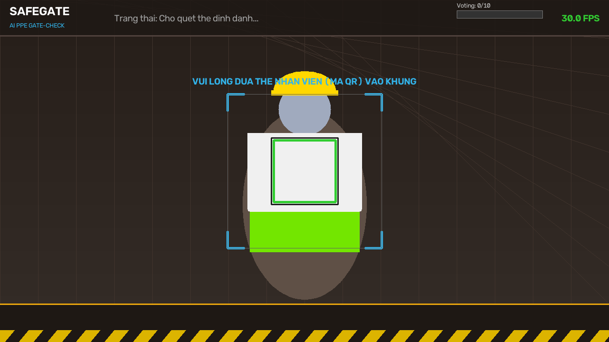
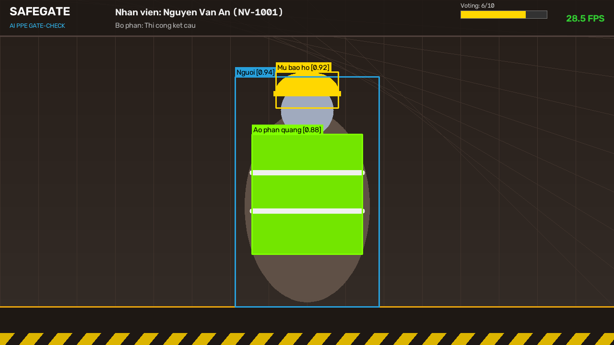
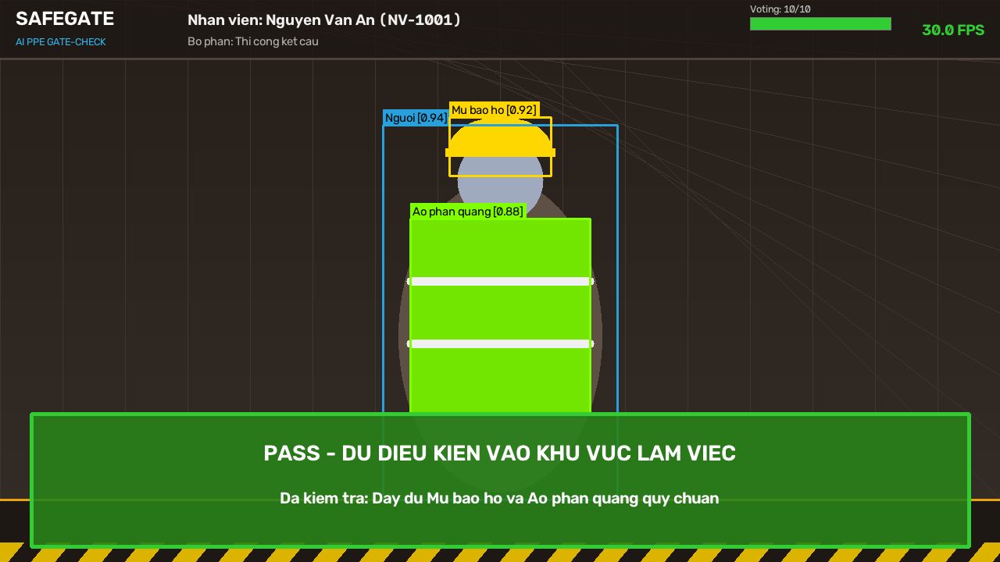
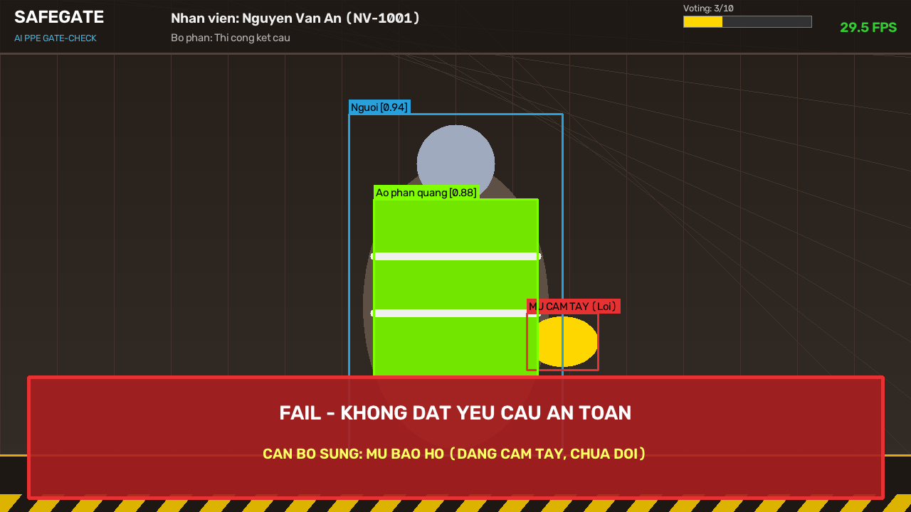

# SAFEGATE - CỔNG KIỂM TRA ĐỒ BẢO HỘ LAO ĐỘNG (PPE) BẰNG AI

> **Đề tài môn Công nghệ Phần mềm (CNPM) | Kế hoạch thực hiện 5 tuần (50 giờ)**  
> **Nền tảng:** Laptop tiêu chuẩn có Webcam (hỗ trợ cả Chế độ giả lập khi không có webcam), không phát sinh chi phí phần cứng bổ sung.

---

## 📸 HÌNH ẢNH GIAO DIỆN HỆ THỐNG

| 01. Chờ quét thẻ QR định danh | 02. Kiểm tra PPE & Voting 8/10 |
| :---: | :---: |
|  |  |

| 03. Kết quả ĐẠT (PASS) | 04. Bắt lỗi Gian lận (Cầm mũ trên tay) |
| :---: | :---: |
|  |  |

---

## 1. GIỚI THIỆU TỔNG QUAN

Trong các công trường xây dựng và nhà xưởng công nghiệp, việc công nhân quên hoặc cố tình không trang bị đầy đủ đồ bảo hộ lao động (Personal Protective Equipment - PPE) như **Mũ bảo hộ (Hard Hat / Helmet)** và **Áo phản quang (Safety Vest)** là nguyên nhân hàng đầu dẫn đến các tai nạn nghiêm trọng.

**SafeGate** là giải pháp phần mềm thông minh được thiết kế để đặt tại cổng ra vào công trường:
1. Công nhân đứng trước camera và xuất trình mã QR trên thẻ nhân viên để định danh.
2. Hệ thống AI tự động phát hiện người và kiểm tra vị trí mũ bảo hộ, áo phản quang.
3. **Luật hình học (Geometric Rules)** kiểm chứng mũ phải đội trên đầu, áo phải mặc trên thân; ngăn chặn tuyệt đối tình trạng cầm mũ trên tay để gian lận.
4. **Bộ lọc Voting đa khung hình (8/10 frames)** loại bỏ hiện tượng nhấp nháy (flickering), đảm bảo quyết định chuẩn xác.
5. Hiển thị kết quả trực quan khổng lồ: **PASS (Xanh lá)** hoặc **FAIL (Đỏ)** và thông báo rõ các món còn thiếu.
6. Ghi nhận nhật ký ra vào vào cơ sở dữ liệu SQLite theo đúng tiêu chuẩn bảo vệ quyền riêng tư: **TUYỆT ĐỐI KHÔNG LƯU ẢNH CỦA CÔNG NHÂN**.
7. **Đa nền tảng giao diện:**
   - 🌐 **Web Quản lý HSE (GitHub Pages Host):** [https://v2tacodin.github.io/SafeGate/](https://v2tacodin.github.io/SafeGate/) (Không cần cài đặt, xem & in thẻ QR, xuất CSV, phân tích an toàn).
   - 📱 **Ứng dụng Flutter Client (Web & Windows Desktop):** Giao diện cổng kiểm soát thời gian thực.
   - 💻 **Ứng dụng OpenCV Gate Runner:** Giao diện camera thời gian thực hỗ trợ cả webcam vật lý lẫn camera giả lập.
   - 📊 **Streamlit Dashboard:** Bảng điều khiển quản trị cục bộ.

---

## 🌐 BẢN PHẦN MỀM / WEB DÀNH CHO QUẢN LÝ (GITHUB PAGES)

Trang web quản lý dành cho cán bộ an toàn (HSE) và ban chỉ huy công trường được host trực tiếp trên **GitHub Pages**:

👉 **Truy cập trực tuyến:** **[https://v2tacodin.github.io/SafeGate/](https://v2tacodin.github.io/SafeGate/)**

### Các tính năng chính trên Web GitHub Pages:
- 📈 **Bảng điều khiển tổng quan (Executive Dashboard):** Giám sát tổng số lượt kiểm tra, tỷ lệ tuân thủ HSE (%), biểu đồ lưu lượng theo khung giờ cao điểm và danh sách cảnh báo vi phạm gần nhất.
- 📋 **Nhật ký ra vào & Xuất CSV:** Tra cứu, lọc theo trạng thái PASS/FAIL, theo nhà thầu/đội thi công. Hỗ trợ **xuất file CSV (UTF-8 BOM)** mở được ngay trên Microsoft Excel.
- 🪪 **Quản lý Nhân viên & In Thẻ QR:** Xem danh sách công nhân, đăng ký công nhân mới, tự động sinh mã QR chất lượng cao và hỗ trợ **In ấn thẻ nhân viên chuẩn kích thước** trực tiếp từ trình duyệt (`Ctrl + P`).
- 📊 **Phân tích an toàn lao động:** Thống kê phân loại các lỗi vi phạm phổ biến (thiếu mũ, thiếu áo phản quang, cầm mũ trên tay...) và xếp hạng mức độ tuân thủ theo nhà thầu.
- 🔄 **Chế độ Kép (Dual Mode):** Chạy 100% độc lập trên đám mây (Cloud Demo với LocalStorage) hoặc kết nối đồng bộ trực tiếp tới máy trạm SafeGate AI (`http://localhost:8000`).

---

## 2. KIẾN TRÚC PHẦN MỀM (SOFTWARE ARCHITECTURE - CH06 CNPM)

Hệ thống được thiết kế theo mô hình kiến trúc phân tầng (Layered Architecture) kết hợp Client - Server:

```
+-------------------------------------------------------------------------------+
|                       PRESENTATION LAYER (GIAO DIỆN)                         |
|  - Flutter Client App (Material 3, Dark Slate & Electric Cyan Theme)          |
|  - Realtime Gate Runner (OpenCV HUD, Target Reticle, Big Status Banners)      |
|  - Management Portal (Streamlit Dashboard, Thống kê, Báo cáo, Quản lý thẻ QR)  |
+-------------------------------------------------------------------------------+
                                      |
                       REST API & MJPEG Streaming
                                      |
+-------------------------------------------------------------------------------+
|                      BUSINESS LOGIC & ENGINE (NGHIỆP VỤ)                      |
|  - SafeGatePipeline (Máy trạng thái: QR Scan -> PPE Check -> Result Banner)   |
|  - GeometricRuleValidator (Kiểm tra vị trí không gian hình học, chống cầm tay)|
|  - MultiFrameVoter (Sliding Window 10 frames, kích hoạt PASS khi đạt 8/10)    |
|  - QRScanner (OpenCV QRCodeDetector giải mã thẻ nhân viên)                    |
|  - ModelOptimizer (Export ONNX, Quantize INT8, Benchmark Latency & FPS)       |
+-------------------------------------------------------------------------------+
                                      |
+-------------------------------------------------------------------------------+
|                          AI INFERENCE LAYER (TRÍ TUỆ NHÂN TẠO)                 |
|  - YOLOv8 Nano (.pt) / ONNX Runtime (.onnx)                                   |
|  - Classes: person, helmet, vest                                              |
+-------------------------------------------------------------------------------+
                                      |
+-------------------------------------------------------------------------------+
|                         DATA ACCESS LAYER (DỮ LIỆU)                           |
|  - SQLite (safegate.db): Bảng employees, Bảng access_logs                     |
|  - TIÊU CHUẨN PRIVACY: Tuyệt đối không lưu ảnh công nhân                     |
+-------------------------------------------------------------------------------+
```

---

## 3. CÁC TÍNH NĂNG VÀ THUẬT TOÁN ĐẶC TRƯNG

### 3.1. Thuật toán kiểm tra bằng Luật hình học (Geometric Rule)
Nhận diện vật thể bằng AI chỉ cho biết sự xuất hiện của `helmet`, nhưng không xác định công nhân có thực sự **đang đội mũ** hay chỉ **cầm trên tay**. SafeGate giải quyết bài toán này bằng thuật toán hình học:
- **Tọa độ chuẩn hóa:** Xác định Bounding Box của công nhân $B_{person} = [x_1, y_1, x_2, y_2]$ với chiều cao $H = y_2 - y_1$.
- **Vùng đầu (Head Zone):** Tâm mũ $(C_{hx}, C_{hy})$ phải nằm trong khoảng:
  $$\frac{C_{hy} - y_1}{H} \le 0.38$$
  và nằm trong biên độ ngang của cơ thể.
- **Phát hiện gian lận:** Nếu phát hiện `helmet` nhưng $\frac{C_{hy} - y_1}{H} > 0.40$, hệ thống gắn cờ vi phạm: **"Mũ bảo hộ (Đang cầm tay, chưa đội)"**.
- **Vùng thân (Torso Zone):** Tâm áo phản quang phải nằm trong khoảng $0.20 \le \frac{C_{vy} - y_1}{H} \le 0.85$.

### 3.2. Bộ lọc Voting đa khung hình (Multi-Frame Voting)
- Sử dụng cửa sổ trượt $N = 10$ khung hình gần nhất.
- Trạng thái **PASS** chỉ được xác lập khi:
  $$\text{Số frame hợp lệ trong window} \ge 8 \quad \text{hoặc} \quad \text{Số frame hợp lệ liên tiếp} \ge 8$$
- Nếu sau $7.0$ giây không đạt ngưỡng, hệ thống kích hoạt **FAIL** và thông báo các trang bị vi phạm phổ biến nhất.

### 3.3. Định danh bằng mã QR
- Tích hợp `cv2.QRCodeDetector` quét nhanh thẻ nhân viên với vùng căn chỉnh mục tiêu đồ họa trực quan.
- Tra cứu tức thời thông tin: Mã nhân viên, Họ tên, Bộ phận làm việc từ SQLite.

---

## 4. HƯỚNG DẪN CÀI ĐẶT & CHẠY ỨNG DỤNG

### 4.1. Kích hoạt môi trường ảo
Trên Windows PowerShell:
```powershell
.\.venv\Scripts\Activate.ps1
```

### 4.2. Chạy ứng dụng Giao diện FLUTTER (Khuyên dùng)
1. **Khởi động Backend API (FastAPI):**
```powershell
.\.venv\Scripts\python -m uvicorn safegate.api.server:app --host 0.0.0.0 --port 8000
```
2. **Khởi chạy ứng dụng Flutter (Web hoặc Windows):**
```powershell
cd safegate_flutter
flutter run -d chrome
# Hoặc chạy Windows Desktop: flutter run -d windows
```

### 4.3. Chạy Cổng kiểm tra thời gian thực với Webcam (OpenCV)
```powershell
python safegate/run_gate.py
```
> *(Hệ thống tự động kích hoạt **Camera giả lập (Virtual Simulator)** nếu máy tính của bạn không có webcam).*  
> **Phím tắt tương tác:**
> - `[S]`: Giơ thẻ nhân viên QR vào khung ngắm.
> - `[SPACE]`: Kích hoạt kiểm tra nhanh công nhân mẫu.
> - `[H]`: Bật/Tắt mô phỏng Mũ bảo hộ.
> - `[V]`: Bật/Tắt mô phỏng Áo phản quang.
> - `[T]`: Mô phỏng cầm mũ trên tay (thử nghiệm luật hình học chống gian lận).
> - `[R]`: Đặt lại về trạng thái chờ quét thẻ.
> - `[Q]` hoặc `[ESC]`: Thoát ứng dụng.

### 4.4. Chạy Cổng quản trị Web Dashboard (Streamlit)
```powershell
streamlit run safegate/app.py
```
Trình duyệt sẽ tự động mở tại `http://localhost:8501`.

### 4.5. Chạy bộ kiểm thử tự động (Unit Tests)
```powershell
python -m unittest safegate/tests/test_safegate.py
# Kiểm thử widget Flutter:
cd safegate_flutter && flutter test
```

---

## 5. KẾ HOẠCH THỰC HIỆN 5 TUẦN (50 GIỜ - CNPM CH03 & CH22)

| Tuần | Mục tiêu chính | Đầu ra bàn giao (Deliverables) | Mốc nghiệm thu bắt buộc |
| :--- | :--- | :--- | :--- |
| **Tuần 1** | Khảo sát yêu cầu, chuẩn bị dữ liệu | Cấu trúc dự án, SQLite DB, Dataset Roboflow PPE | Schema DB hoàn chỉnh, Dataset sẵn sàng |
| **Tuần 2** | AI Detection & Model Training | Script train Colab/Kaggle, Weights YOLO nano | Model nhận diện được person, helmet, vest |
| **Tuần 3** | Core Engine & Thuật toán | Module Luật hình học, Voting 8/10, Quét QR | Vượt qua Unit Tests, bắt được lỗi cầm mũ tay |
| **Tuần 4** | Giao diện Flutter & Dashboard | Giao diện Flutter hiện đại, Streamlit Quản trị | Hệ thống chạy trơn tru với video stream |
| **Tuần 5** | Tối ưu hóa, Benchmark & Nghiệm thu | Export ONNX, Quantize INT8, Báo cáo đồ án | Đo đạc FPS > 25 trên laptop, slide & báo cáo |
